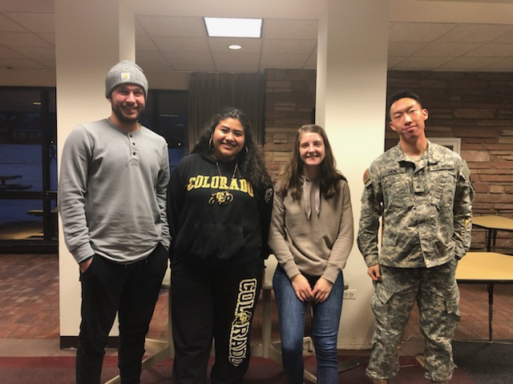
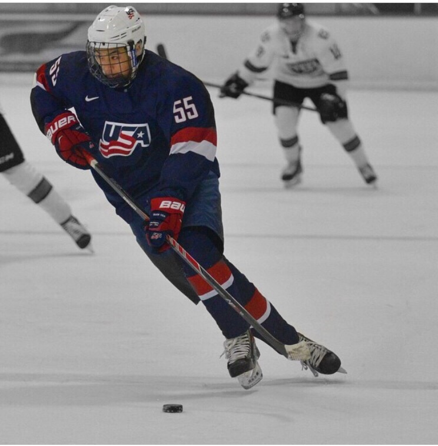

---
title: "LA_2"
<<<<<<< HEAD
author: "Adam"
date: "1/24/2019"
output: html_document
---

```{r setup, include=FALSE}
knitr::opts_chunk$set(echo = TRUE)
```


=======
author: "Adam Hayes, Erin Omyer, Jasmine Sanchez, and Richard Park"
date: "1/24/2019"
output:
  html_document: default
  pdf_document: default
---

## Alge-bros and Inter-girls 



## Team Goal
Our goal is to become proficient in R, and learn better how R, GitHub, and GitKraken communicate together.  We also want to learn how to work efficiently as a team.

## About Jasmine


* I would like to know what the difference in Educated voters, versus non-Educated voters within the US is, and how that fluctuates depending on where the voters live, as well as how much access they have to voting? 

* Six months after graduating, I hope to have gained a full time position as a Data Statistician for a compnay. (Preferrably Arrow Electronics). Five Years after that, I hope to have gained enough insight and support to have transitioned into a leadership role within my team, then later within my division of whatever company I will be a part of. 

* My greatest career accomplishment will be creating more evenly accessible platforms of data collection for varrying envrionments and communities where interpretation is clear.

* Given these hopes and goals, I want to learn and understand the several ways we, as individuals process data and then interpret/communicate that information to other entities. 

* Fun Fact: I have 2 Siblings, an older sister who is 21  and a younger brother who is 11.

### Erin's Feedback: 
I think the overall setup of for your assignment is well organized. The two pictures were a bit overwhelming at first, but I think they tie into your about yourself section well.

### Adam's Feedback:
Jasmine, I think your information is well organized and to the point.  Maybe you could have numbered the questions instead of bullet points, but I still like the bullet points.

### Richard's Feedback:
Add more detail about siblings.

## About Erin


* Non-Statistical Question: How many hours does it take for an actor/actress to memorize their lines?
* Roughly six months after graduation, I would love to have a job with an organization that I am happy to work for, which allow myself to start a pathway into my future. Five years beyond graduation, I would hope I would be experiencing a life that is continuously enjoy. Whether that involve new friends, places, work experience, etc. 
* I hope my greatest career accomplishment would be a career where I am continuously looking forward to what I am applying in the organization. The greatest career won't be making the most amount of money, but ensuring that I am content with my career and life that follows.
* In Introduction to Data Science, I hope to learn the basic functions of coding in R. This will allow myself to expand further into other programming languages and accomplish cooperative communication. 
* Lastly, an interest fact about myself is that my right ear is smaller than my left ear, so I would be called "nemo" when I was little. 


### Jasmine's Feedback 
- Could use more detail in your answers, we want to know what makes you happy in a certain job, etc. 
- Your interesting act is awesome :) 

### Adam's Feedback:
I think your content is good and your interesting fact is funny.  Maybe you could have added a little more detail in why you chose your Non-Statistical Question.

### Richard's Feedback
I think that you could put more emphasis and specify more details in your plans 6 months after graduation. Maybe you could mention which companies interest you?

## About Richard



A question I would like to know the answer to (by analyzing data) is whether or not GMO's are healthy for you or not. Six months after graduation I would like to be serving in the medical service branch in the army or attending medical school. I hope that my greatest career accomplishment is to help as many families as possible by providing them with the medical care that they need. Therefore, given these aspirations, I would like to learn how to properly use programming to help me analyze data that I might be using for research later in life.Fun fact: my hobbies include playing hockey, cooking (even though I'm awful at it), and working out at the gym. 


### Erin's Feedback:
The information provided is intriguing to read, but I think it would have been organized better if bullet points were used. 

### Jasmine's Feedback:
- I think that your answers could have been more organized by using bullets or even spacing in between.   
- Overall, you answers sound great and your hobbies are super fun too! 


### Adam's Feedback:
I also think you could have used bullet points or numbers to add more clarity, but I think you were very detailed and answered the questions thoroughly

## About Adam


* One thing I would love to analyze data about is how many college students that aren't 21 drink alcohol on a regular basis, i.e. at least once a week.  
* After graduation, I hope to be able to spend a few months not working, but rather traveling and doing things I enjoy while being picky in choosing a career path.  By 6 months after graduation I would love to be starting my first real job that could end up leading into a career, and then by 5 years post graduation I hope to be completely decided in where I am going with my career, and have a really good head start on it.  What would make me most happy is being able to use data science to help affect the world in a positive way.  
* My greatest career achievement would be to make a strong impact in whatever field I end up in by creating something new that will help change the way people in that field think about things and approach data.  
* In this course, I hope to develop a stronger understanding of how to utilize data in the world of computer science because I know  I will need these skills to pursue a career in the future.  
* One interesting thing about me is that my interest in Data and Statistics came largely from the book/movie Moneyball, about Billy Beane who greatly influenced a change in how people approach scouting in Major League Baseball.


### Erin's Feedback:
Overall, I think the design of your section is well organized. The bullet points make it easy to read and understand what you are conveying about yourself.

### Jasmine's Feedback:
- I like how you are consistent with one format for your question responses.
- I think that your goals are great and I especially like that your passion for data science started from a movie. 

### Richard's Feedback:
Perhaps you could be more specific with your goals in the course.

